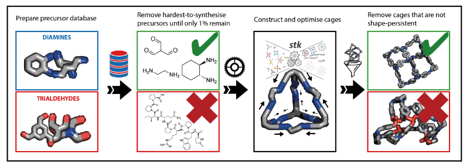

Modelling Chemist Intuition for the Synthetic Accessibility of Porous Organic Cages
===================================================================================

Description
-----------

This repository contains code used to reproduce the paper ().
The MPScore model classifies a molecule as 'easy-to-synthesise' (0) or 'difficult-to-synthesise' (1), based on training data obtained 
from three expert chemists. 
The model returns a probability that a molecule belong to the 'difficult-to-synthesise' class, which can be interpreted as a continuous score,
such that a lower score indicates a molecule is easier-to-synthesise.

Summary
-------

In this work, we use high-throughput screening to discover if it possible to form shape-persistent cages from the easiest-to-synthesise (as shown in the above figure).
We screen for easiest-to-synthesise precursors, followed by constructing cages from those precursors, with the aim of identifying cages that remain shape persistent.

Contents
-----------

The repository is organised in the following way:
- `data`
    - `training_mols.csv`: Contains all the molecules in SMILES format that were provided to the three chemists for labelling.
    - `chemist_scores.csv`: Contains the training data for the MPScore, consisting of molecules in SMILES format, followed by a 1 or 0, in addition to the chemist that scored them.
    - `reaxys_precursors.csv` Contains diamines and trialdehydes used to build cages in the high-throughput screening part of the paper.
    Precursors were screened for their synthetic accessibility, before building a cage using `stk` and undergoing a fast geometry optimisation.
- `scripts`
    - `mpscore.py`: Contains code to reproduce the cross-validation procedure performed in the paper, in addition to training the final MPScore model.
    The code to reproduce the precision recall curve (Figure 5b in the main paper) is also present here.
    For end users wanting to test the MPScore, the function `get_score_from_smiles` is available.
    This will return a `float` of the synthetic difficulty of a molecule.
    - `cage_optimise.py`: Contains code to perform the optimisation procedure used in the paper, which makes extensive use of the MacroModel software.
    To replicate this procedure, the user must have MacroModel installed, in addition to the identical version of `stk` used in the paper. 
    The provided `environment.yml` file will install all dependencies into a new Anaconda environment named `mpscore`.
    Generally, this code takes input of the cage precursors from a `.csv` file of the form `diamine SMILES`, `trialdehyde SMILES` and populates a MongoDB database with tbe cage in a dictionary format. 
    - `property_calculate.py`: Contains code to perform property calculations on optimised cages.
    This makes extensive use of `RDKit` and `pywindow` to perform optimisations, which can be easily installed using the given `environment.yml` file.

- `notebooks`
    - `database_analysis.ipynb`: Contains code to reproduce Figure 4 and Figure 6, which are based on the synthetic difficulty score distributions of the training dataset, and the dataset of precursors used for cage screening.
    In this notebook synthetic difficulty scores are calculated and plotted.
    - `cage_analysis.ipynb`: Reproduces Figure 7 from the main text, which shows the distributions of cavity sizes for shape persistent cages. In this notebook cages are loaded directly from MongoDB and filtered for their properties.

- `models`
    - `mpscore.pkl`: The pickled model MPScore model. Can be loaded using the `pickle` builtin module.

- `site`
    Contains the code for the website provided to experimental chemists to label molecules as easy- and difficult-to-synthesise.